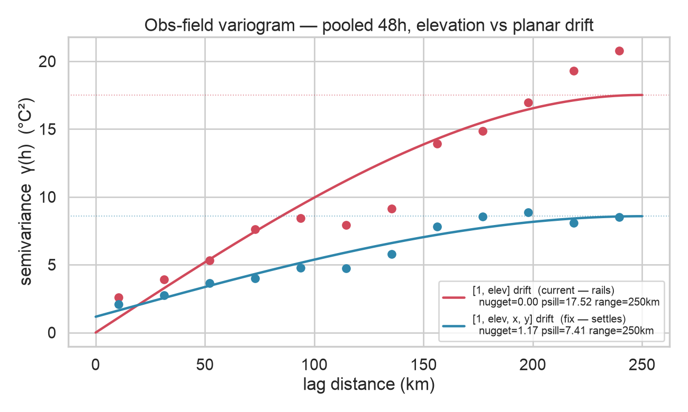
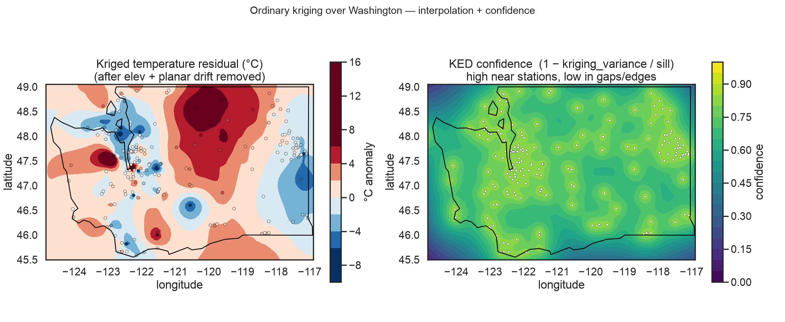

# variogram-fit

Offline tool that fits the two frozen spherical variograms used by
`internal/weather/field`. This is the only Python in the serving path's design —
it runs occasionally, offline, and its output (six numbers) is hardcoded into
the Go.

## What it fits

- **obs field** (nowcast confidence/interpolation): spatial correlation of real
  NWS station temperature after an elevation drift is removed — the same
  `[1, elev]` drift KED regresses out.
- **residual field** (forecast bias): spatial correlation of `obs - model`
  (Open-Meteo) at the stations, also elevation-detrended.

Coordinates are projected to UTM 10N (EPSG:32610) metres via `pyproj`, matching
`internal/weather/proj`, so the fitted `Range` is in the units the Go expects.
The spherical model fit here is identical to `ked.Variogram.Cov`, so the params
transfer directly.

## Run

```bash
cd tools/variogram-fit
uv run fit.py                 # ~300 stations, both variograms
uv run fit.py --stations 500  # denser fit
uv run fit.py --no-residual   # obs field only (skips Open-Meteo)
```

It prints Go-ready literals to stdout:

```go
// ---- paste into internal/weather/field/field.go ----
	obsVariogram   = ked.Variogram{Nugget: ..., PSill: ..., Range: ...}
	residVariogram = ked.Variogram{Nugget: ..., PSill: ..., Range: ...}
```

Paste those over the placeholder vars in `field.go`.

## Visualize

```bash
uv run viz.py            # writes docs/variogram.png and docs/kriged_map.png
```

**Why the drift is `[1, elev, x, y]`** — experimental + fitted spherical for
elevation-only vs planar drift. Red (elev only) keeps climbing past its sill
(non-stationary → rails); blue (planar) levels off at a real sill (stationary):



**Interpolation + confidence** — ordinary kriging of the (elev+planar)-detrended
temperature residual over WA, plus the kriging-variance confidence field, with
the station network and WA state boundary overlaid. The confidence panel is the
same field the API serves, made spatial (bright near stations, dark in
gaps/edges):



The state outline is fetched from a public US-states GeoJSON (skipped with a
warning if offline). `docs/*.png` are committed reference renders — re-run
`viz.py` to refresh; they use a live weather snapshot, so expect the anomaly
pattern to change between runs.

## What the data says (findings from real runs)

- **Pooling matters.** A single-instant temperature field carries a transient
  synoptic gradient that elevation-detrend doesn't remove, so a single-snapshot
  fit is noisy and the range rails. The tool pools `--hours` (default 48) of
  observations per station (`/observations?limit=N`), averaging binned
  semivariance across hours — this stabilizes the short-range structure. Run
  produces dense bins (thousands of pairs/bin) and a stable **nugget + partial
  sill** (~0.5 / ~7 for the obs field — close to the current placeholders,
  validating them).

- **The obs field is non-stationary at synoptic scales.** Even pooled, the
  elevation-detrended temperature semivariance keeps rising past 120–220 km:
  temperature is long-correlated, so a single spherical `range` is not freely
  identifiable — it **pins to `--max-dist`**. That's expected, not a bug: set
  `--max-dist` to your kriging-neighborhood scale (nearest-25 is typically
  <~100 km) and treat nugget+psill as the data-derived local structure. The full
  fix is regime-stratified variograms (stable/windy/transitional), which
  `ked.go` explicitly defers.

- **The residual (obs−model) field** needs model values at the SAME timestamps
  to be pooled properly. Right now it uses a single current snapshot (unstable
  run-to-run); pooling it requires the Open-Meteo **archive** API at historical
  hours. That's the main TODO before pasting a data-derived `residVariogram`.

## Status

The obs-field nugget/psill are data-validated; the placeholders in `field.go`
are reasonable. Before replacing them wholesale: (1) pool the residual field
over historical hours, (2) fix `--max-dist` to the neighborhood scale, (3)
optionally stratify by weather regime. Re-run seasonally.
